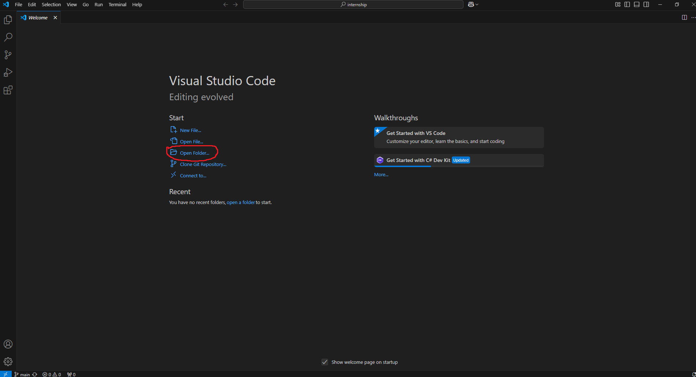
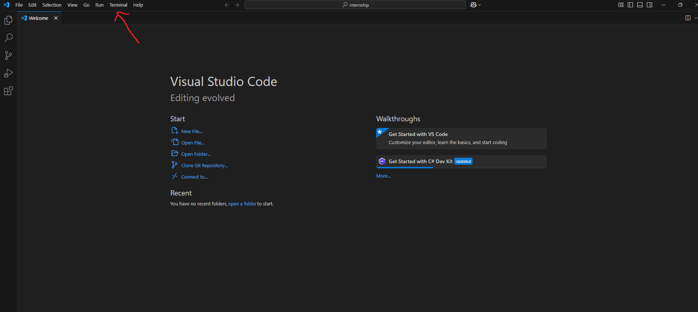

# About the project

The project is a test task for [Wolt Software Engineering internship](https://www.linkedin.com/jobs/search/?currentJobId=4124732480&distance=25.0&geoId=102974008&keywords=software%20developer%20intern&origin=HISTORY).

The project itself is a calculator that was made to calculate the price brekdown of a delivery order for the user.

## Instalation and Setup

For the project to work you need to have [Node js and npm](https://nodejs.org/en/learn/getting-started/introduction-to-nodejs) on your pc.

### How to install npm Node js 
If you don't then you can install the Node js [here](https://nodejs.org/en).

when the package downloaded click on it. The instalation window will be opened. Choose from given options and press 'Download'. 

### Setup the project







In the terminal you need to write this command:

```bash
yarn install
```

**NB! If you don't have yarn installed use this command:** 

```bash
npm install -g yarn
```

## Project Running

When all of the above was made, it is time to look at the project. To start the work you can use the command:


```bash
npm start
```

Or:

```bash
yarn start
```

## Running Tests

To run tests, run the following command

```bash
  npm test
```
 Or use:

```bash
  yarn test
```