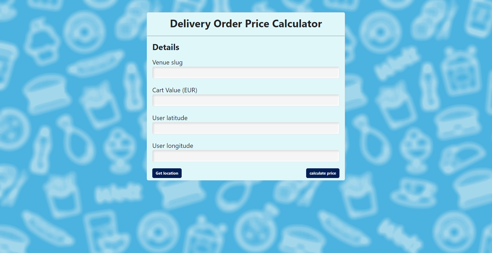

# About the project

The project is a test task for [Wolt Software Engineering internship](https://www.linkedin.com/jobs/search/?currentJobId=4124732480&distance=25.0&geoId=102974008&keywords=software%20developer%20intern&origin=HISTORY).

The project itself is a calculator that was made to calculate the price breakdown of a delivery order for the user.

## Instalation and Setup

For the project to work you need to have [Node js and npm](https://nodejs.org/en/learn/getting-started/introduction-to-nodejs) on your pc.

### How to install npm Node js 
If you don't then you can install the Node js [here](https://nodejs.org/en).

when the package downloaded click on it. The instalation window will be opened. Choose from given options and press 'Download'. 

### Setup the project

The next step is to open Visual Studio Code and open the downloaded project. You can make it by pressing the button Open Folder.


After opening the project open the terminal by pressing Terminal -> New terminal


In the terminal you need to write this command:

```bash
yarn install
```

**NB! If you don't have yarn installed use this command:** 

```bash
npm install -g yarn
```

## Project Running

If all of the criterias above were made, it is time to look at the project. To start the work you can use the command:


```bash
npm start
```

Or:

```bash
yarn start
```

You should be redirected to the project and if not then write [localhost:3000](localhost:3000) in the search in your browser.

the page should look like this:



The **Venue slug** input is for getting the location from given API. You can insert there only one of the two given locations:

- home-assignment-venue-helsinki
- home-assignment-venue-tallinn

The **Cart Value** is for the value of the shopping cart in EUR. This part will only work if write there number and nothing more. For example you can take the number 10, 5.5 or 103.32;

The **User latitude** and **User Longitude** are user coordinates which can be written mannualy but if you don't know your location you can always press the button **Get location.**

The last component is the button **calculate price.** The button works only if all conditons are met, so before clicking the button and getting the result you need to fill all the input with data which type is also correct.

After getting everything correctly and pressing the button, the price breakdown will appear for the user.

## Running Tests

To run tests, run the following command

```bash
  npm test
```
 Or use:

```bash
  yarn test
```